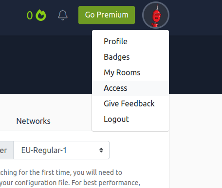

\#Introduction Hello welcome to our introduction CTF. This CTF is to
give you an idea of how does ethical hacking works within a CTF
environment. If you don’t know what a CTF, a CTF is basically a
exercise/game in which “flag” are hidden within purposefully-vulnerable
programs or websites. A CTF flag would look something
“CTF{g3t\_g00d\_n00b2}” and would be hidden within a root/admin folder.
There are multiple types of CTFs such as: Forensic CTFs (which utilities
digital forensics), Web CTFs where the attacker attacks a web server
(which is what we will be covering today), Reverse Engineering (which
involve exploiting a program binary), etc.

The platform that this CTF will be hosted is TryHackMe but they are many
other websites such as HacktheBox, PicoCTF, etc.

\#Prerequisites: \* This guide assumes you have already installed and
setup a Linux distro. \* This also assumes your familiar with your
Distribution’s package manager and can use it from the command line. \*
OpenVPN \* Gobuster \* A Linux Distribution running in a VM, WSL, Docker
container or Live USB preferably a Pen Testing focused one (Since they
contain a wide selection of pen testing and digital forensic
applications preinstalled) such as: \* Kali Linux (Debian Testing base)
-
<a href="https://www.kali.org/get-kali" class="uri">https://www.kali.org/get-kali</a>.
\* Parrot Security (Debian Testing base) -
<a href="https://parrotsec.org/" class="uri">https://parrotsec.org/</a>
\* BlackArch (Arch Linux base) -
<a href="https://blackarch.org/" class="uri">https://blackarch.org/</a>
\* If you’re not familiar with Linux, the best to learn it is to try and
play within a VM and use it has a normal desktop system (Start with
beginner friendly distro such as Linux Mint, Ubuntu LTS, Solus and Pop
OS LTS) for least 30 minutes a day (That’s how I learned it :) ) or
watch this playlist by Network Chuck:
<a href="https://www.youtube.com/playlist?list=PLIhvC56v63IJIujb5cyE13oLuyORZpdkL" class="uri">https://www.youtube.com/playlist?list=PLIhvC56v63IJIujb5cyE13oLuyORZpdkL</a>.

\#Step 1 - Connect to TryHackMe via OpenVPN Download and install OpenVPN
from your distro repos (If it’s not installed). “Sudo apt install
openvpn”. Then login to TryHackMe, create an account if you don’t
already have.

 Click on your profile
and select in the drop down box “Access”.

 Then click “Download my Configuration File” once
you have selected the closest VPN Server.

\[Figure 3\] (./Terminal.png) Finally open a terminal but clicking it on
desktop menu or by using the keyboard shortcut “Ctrl+Alt+Del” cd into
your Downloads directory then type in "sudo openvpn *Your THM
Username*.ovpn to load the OpenVPN configuration file (Please keep the
terminal window that OpenVPN is running open).

\[Figure 4\] (./Status.png) Then check the access to verify that your is
connected to the THM Network. Now you’re ready for hacks :D.

\#Step 2 - Deploy your VM

\[Figure 5\] (./Start\_Machine.png)

Click on Start Machine to begin and wait 1 minute for the IP address to
display.

\[Figure 6\] (./FakeBank.png) Once the IP address has been displayed,
paste the IP address into your browser search box and the “fakebank”
webpage should appear.

\#Step 3 - It’s Gobusting Time

We will be using the program “Gobuster” to brute-force the webpage for
possible server directories using a word list. Check for dirbuster
word-lists in the folder “/usr/share/dirbuster/wordlists”. If it’s not
on your system, search for a wordlists package in your distro repos. If
it’s not in your distro repos. Download the wordlists from this github
page:
<a href="https://github.com/pradeepch99/dirbuster_wordlist" class="uri">https://github.com/pradeepch99/dirbuster_wordlist</a>.

Use the command “gobuster -u *THM IP Address* -w *your\_wordlist* dir”
this command performs a brute-force directory attack on the fakebank
website.

\[Figure 7\] (./dir.png) The directories that are found within the
wordlist are accessible pages on the website.

\#Step 4 - Breaking the bank

\[Figure 8\] (./Admin\_Tool.png) The -transfer page should appear within
the scan. This secret bank transfer webpage allows the attacker to steal
money from any bank account registered with fakebank. This is a highly
critical risk to the bank. Since we are ethical hackers in training
(well I hope so \>:( ) we would find the vulnerabilities within the web
application and report to the bank before the hacker exploits them.
Transfer $2000 USD from 2276 into 8881 by using the fake bank staff
account.

\[Figure 9\] (./Flag\_1.png) We should go back to check if “Mrs G.
Benjamin” has successfully received $2000 from fake bank and a flag to
input into TryHackMe.
