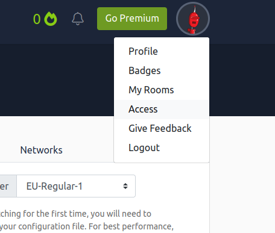
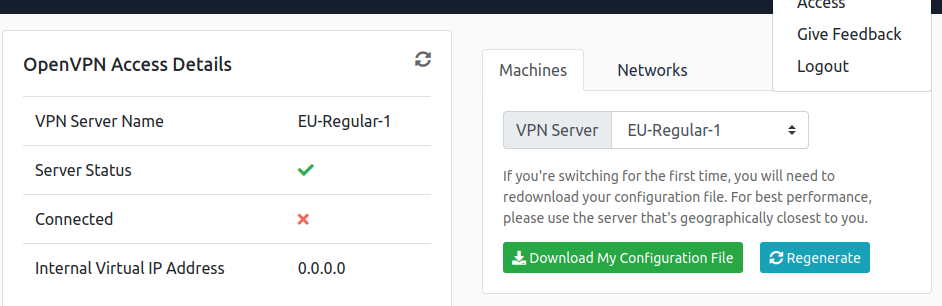

#Introduction
Hello welcome to our introduction CTF. This CTF is to give you an idea of how does ethical hacking works within a CTF environment. If you don't know what a CTF, a CTF is basically a exercise/game in which "flag" are hidden within purposefully-vulnerable programs or websites. A CTF flag would look something "CTF{g3t_g00d_n00b2}" and would be hidden within a root/admin folder. There are multiple types of CTFs such as: Forensic CTFs (which utilities digital forensics), Web CTFs where the attacker attacks a web server (which is what we will be covering today), Reverse Engineering (which involve exploiting a program binary), etc. 

The platform that this CTF will be hosted is TryHackMe but they are many other websites such as HacktheBox, PicoCTF, etc.

#Prerequisites:
  * This guide assumes you have already installed and setup a linux distro.
  * OpenVPN
  * Gobuster
  * A Linux Distribution running in a VM, WSL, Docker container or Live USB preferably a Pen Testing focused one (Since they contain a wide selection of pen testing and digital forensic applications preinstalled) such as:
    * Kali Linux (Debian Testing base) - https://www.kali.org/get-kali.
    * Parrot Security (Debian Testing base) - https://parrotsec.org/
    * BlackArch (Arch Linux base) - https://blackarch.org/
  * If you're not familiar with Linux, the best to learn it is to try and play within a VM and use it has a normal desktop system (Start with beginner friendly distro such as Linux Mint, Ubuntu LTS, Solus and Pop OS LTS) for least 30 minutes a day (That's how I learned it :) )  or watch this playlist by Network Chuck: https://www.youtube.com/playlist?list=PLIhvC56v63IJIujb5cyE13oLuyORZpdkL. 

#Step 1 - Connect to TryHackMe via OpenVPN
Download and install OpenVPN from your distro repos (If it's not installed). "Sudo apt install openvpn". Then login to TryHackMe, create an account if you don't already have.

Click on your profile and select in the drop down box "Access".

Then click "Download my Configuration File" once you have selected the closest VPN Server.

![Figure 3] (./Terminal.png)
Finally open a terminal but clicking it on desktop menu or by using the keyboard shortcut "Ctrl+Alt+Del" cd into your Downloads directory then type in "sudo openvpn *Your THM Username*.ovpn to load the OpenVPN configuration file (Please keep the terminal window that OpenVPN is running open). 

![Figure 4] (./Status.png)
Then check the access to verify that your is connected to the THM Network. Now you're ready for hacks :D.

#Step 2 - Deploy your VM

